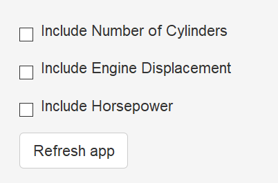
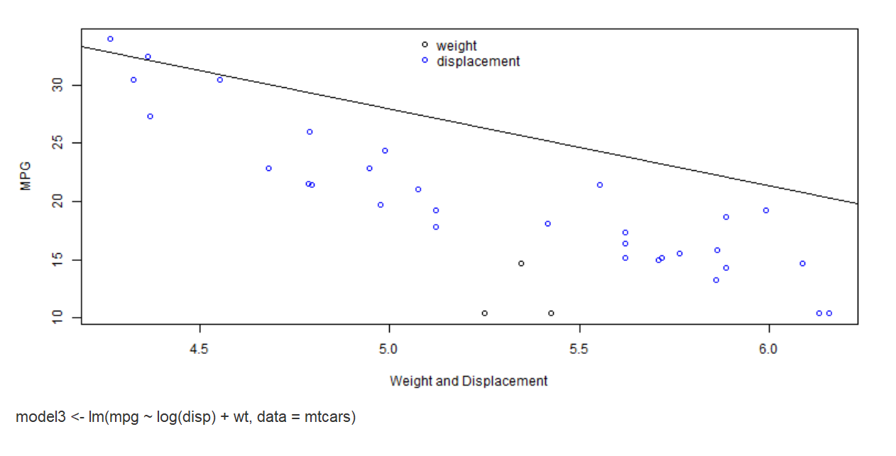

shinyMPG
========================================================
author: Mark Culp
date: 7/16/2017
autosize: true

shinyMPG Features
========================================================
- shinyMPG presents the mtcars data set interactively using four separate predictors: weight, displacement, horsepower, and cylinders, which are used to predict Miles Per Gallon (MPG).
- The actual Miles Per Gallon results in the data set are plotted for all four predictors.  A regression line is drawn based on the composite features.
- The application explores the use of multiple variables as predictors, and their impact on a regression model estimate (represented by a regression line on the plot).

shinyMPG Features (continued)
========================================================
- The user can add predictors by selecting a checkbox associated with each one.  The default predictor is weight, and the weight predictor must be used in the calculation.
- A "Refresh App" button is provided to reset the application.



Logarithm Calculations
========================================================
#### Natural logarithms are calculated for the Displacement and Horsepower variables to facilitate plotting and regression modeling. 


```r
  # Use 2 variables
  model2 <- lm(mpg ~ wt + cyl, data = mtcars)
  model3 <- lm(mpg ~ log(disp) + wt, data = mtcars)
  model4 <- lm(mpg ~ log(hp) + wt, data = mtcars)
  
  # Use 3 variables
  model5 <- lm(mpg ~ log(disp) + cyl + wt, data = mtcars)
  model6 <- lm(mpg ~ log(hp) + cyl + wt, data = mtcars)
  model7 <- lm(mpg ~ log(hp) + log(disp) + wt, data = mtcars)
```

Unexpected Plotting Results
========================================================
- Because multiple variables are used to estimate MPG, the plots of the individual data points don't align with the regression lines produced by combining variables.
- The application highlights the effects of using multiple variables on the regression estimate.


